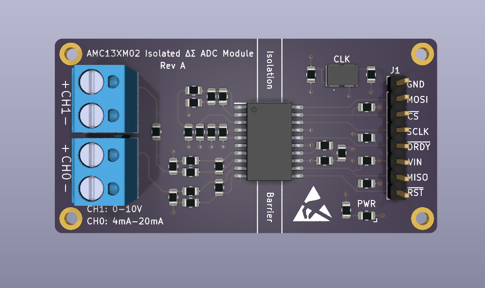

# SensorLink Firmware Repository

This repository contains the firmware for the SensorLink project. The SensorLink project is a project that aims to provide a platform for the development of IoT applications. The project is based on the ESP32 microcontroller and the ESP-IDF framework. 

The goal of this project is to provide a flexible and extensible platform for connecting industrial sensors to the cloud. The firmware is designed to be easy to configure and deploy, and to support a wide range of sensors and communication protocols. 

While this firmware is being developed, I am also working on a PCB design for the SensorLink device. The PCB design will include support for a variety of sensors, including 0 to 10VDC isolated analog inputs, 4-20mA isolated analog inputs, and isolated digital inputs. The PCB design will also include support for a variety of communication protocols, including WiFi, Ethernet, and LoRa.

Here is a prototype of the Analog Isolation Module for the SensorLink project:

</img>


## Getting Started

To get started with the SensorLink project, you will need to have PlatformIO installed on your system. You can install PlatformIO by following the instructions on the [PlatformIO website](https://platformio.org/). Once you have PlatformIO installed, you can clone this repository and open it in PlatformIO.

## Building the Firmware

To build the firmware, you can use the PlatformIO build command. You can run the following command in the root directory of the repository:

```bash
pio run
```
This will build the firmware and generate the necessary binaries.

## Flashing the Firmware

To flash the firmware to the ESP32 microcontroller, you can use the PlatformIO upload command. You can run the following command in the root directory of the repository:

```bash
pio run -t upload
```

This will flash the firmware to the ESP32 microcontroller.

## Initial Configuration

The firmware requires some initial configuration to connect to a WiFi network and MQTT broker. When the SensorLink device is first powered on, it will create a WiFi access point with the SSID `SensorLink-Setup` and default password `123456789`. Once connected to this access point, you can configure the device by visiting the IP address `http://192.168.1.4` in a web browser. You can then enter the SSID and password of your WiFi network, as well as the IP address and port of your MQTT broker. To apply the configuration, you will need to restart the device. The device will then connect to the WiFi network and MQTT broker.

## Roadmap

The SensorLink project is still in development, and there are many features that are planned for future releases. Some of the planned/completed features include:

- [x] Network Configuration via Web Interface
- [x] Web Socket Communication
- [ ] MQTT Communication
- [ ] Web Authentication
- [ ] HTTPS Support
- [ ] TI AMC13XM0X Isolated ADC Driver for ESP32
- [ ] OTA firmware updates via web interface
- [ ] Flash Encryption with Secure Boot
- [ ] Support for additional sensors
- [ ] Support for additional communication protocols
- [ ] Support for additional cloud platforms